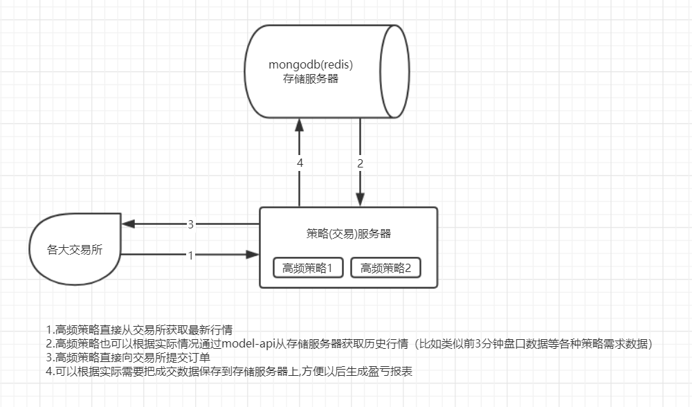

## alphahunter

面向策略对象的异步事件驱动量化交易/做市系统/策略研究/策略回测。


### 框架依赖

- 运行环境
   - python 3.5.3 或以上版本

- 依赖python三方包
   - aiohttp>=3.2.1
   - aioamqp>=0.13.0
   - motor>=2.0.0 (可选)

- RabbitMQ服务器
    - 事件发布、订阅

- MongoDB数据库(可选)
    - 数据存储


### 安装
使用 `pip` 可以简单方便安装:
```text
pip install alphahunter
```


### 目录说明

- 文件夹:

  ./quant 量化基础框架

  ./example 量化策略模板示例

  ./collect 市场行情采集服务
  
  ./datamatrix 包含一些datamatrix示例。
    
  ./backtest 包含一些策略回测示例。
  
  ./notebook 存放策略研究相关文件,如.ipynb文件

- 快速体验
    [Demo](example/)


### 框架说明

本框架使用的是Python原生异步库(asyncio)实现异步事件驱动，所以在使用之前，需要先了解 [Python Asyncio](https://docs.python.org/3/library/asyncio.html)。

本框架利用面向对象思想和面向接口编程思想抽象出一个策略基础类 `Strategy`和一个交易所网关回调接口类`ExchangeGateway.ICallBack`,所有量化策略都需要继承自 `Strategy`基类并且实现 `ExchangeGateway.ICallBack`接口, `Strategy`自带了一个数据管理器 `PortfolioManager`用于统一缓存并管理相应策略的仓位,订单,资产,成交等信息。在策略中可以利用 `Strategy.create_gateway`创建指定的交易所网关与交易所建立连接进行交易,所有交易所网关类都需要继承自 `ExchangeGateway`并且实现其中的抽象方法。然后利用设计模式中的工厂模式和代理模式思想实现了 `Trader`类,统一对各交易所进行创建和管理,在策略中调用 `Strategy.create_gateway`,其实其内部就是利用 `Trader`类创建指定的交易所网关与之建立连接，进行交易。

关于中低频基础框架如下图所示：


关于高频基础框架如下图所示：


关于策略研究回测基础框架如下图所示：


- 当前支持交易所
    - [FTX](example/ftx)
    - [火币] 正在接入中
    - [OKEX] 正在接入中
    - To be continued ...

- 文档
   - [config 服务配置](docs/configure/README.md)
   - [EventCenter 安装RabbitMQ](docs/others/rabbitmq_deploy.md)
   - [Logger 日志打印](docs/others/logger.md)
   - [locker 并发锁](docs/others/locker.md)
   - [Collect 行情采集服务](collect/README.md)
   - [Python Asyncio](https://docs.python.org/3/library/asyncio.html)
